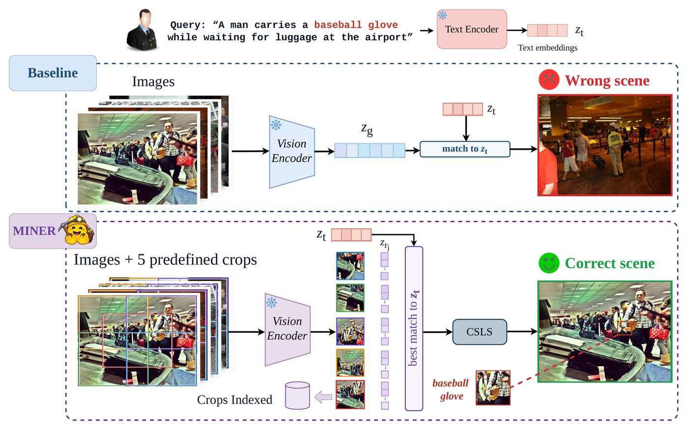

<div align="center">

# MINER: Multi-crop INference-time Enhancement for Rare-Object Retrieval with Frozen Dual Encoders


[Paper](#) | [Dataset](https://huggingface.co/datasets/AbdulmalekDS/ROCS)

</div>



MINER improves text-to-image retrieval with a frozen encoder. It encodes the full image and five square crops, blends their scores, and applies CSLS to reduce hubness.

ROCS is the benchmark it is evaluated on: cluttered COCO and Flickr30K scenes re-captioned so each query names one small, rare object.

`appendix/` holds what the paper reports but the method does not need: the
saliency-source comparison of Table 4, and `appendix/optimization/`, where CSLS
is written six ways, numpy, C++, Rust, Julia, torch and CUDA, and timed against
a growing gallery.

## Run

Python 3.10 or newer, with PyTorch for your hardware:

```bash
pip install -r requirements.txt
python evaluate.py --model siglip2 --split coco   # one cell
./reproduce.sh                                    # every backbone, both splits
```

Captions, images and model weights all download on first run. Each run prints R@1, R@5
and R@10 for global retrieval, global retrieval with CSLS, and MINER.

| Flag | Default | |
|---|---|---|
| `--model` | `siglip2` | or `clip-large`, `siglip-so400m` |
| `--split` | `coco` | or `flickr30k` |
| `--alpha` | `0.4` | weight on the best crop |
| `--k` | `10` | CSLS neighbours; `0` disables it |
| `--crops` | `fixed` | `grid` or `random`, the Table 1 comparison |
| `--crop-ratio` | `0.6` | crop side as a fraction of the shorter edge |
| `--n-regions` | `5` | crops per image |
| `--limit` | | first N images, for a quick check |

CSLS is computed over the full evaluation matrix, matching the paper. Random crops keep
the original 30–70% scale range, so that row moves a little with `--seed`.

To score your own COCO-format file, pass `--annotations` and `--images-dir` together. It
needs `images` entries with `id` and `file_name`, and `annotations` entries with
`caption` and `id` (or COCO-style `image_id`).

## Results

R@1, reported as ROCS-COCO / ROCS-Flickr30K. `evaluate.py` prints these three rows, so they double as the targets to check a run against.

| Backbone | Global | Global + CSLS | MINER |
|---|---|---|---|
| CLIP L/14 | 29.10 / 31.98 | 34.93 / 37.14 | 37.12 / 39.47 |
| SigLIP So/14 | 45.41 / 46.18 | 48.75 / 50.05 | 50.59 / 52.15 |
| SigLIP 2 So/16 | 47.08 / 48.00 | 50.29 / 52.28 | 52.36 / 53.84 |
